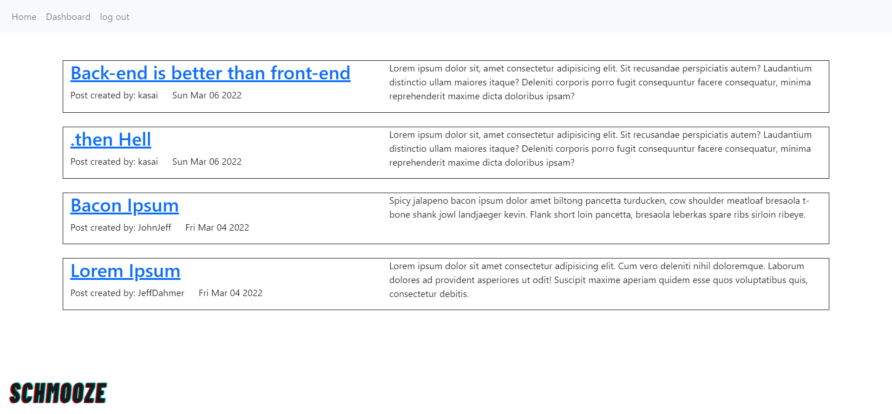

 
## License


## Table of contents
* [Description](#description)
* [Technologies](#technologies)
* [Preview](#preview)
* [Deployed](#deployed)

## User Story

```md
AS A developer who writes about tech
I WANT a CMS-style blog site
SO THAT I can publish articles, blog posts, and my thoughts and opinions
```

## Description

Writing about tech can be just as important as making it. Developers spend plenty of time creating new applications and debugging existing codebases, but most developers also spend at least some of their time reading and writing about technical concepts, recent advancements, and new technologies. 

With Developer Schmooze, Dev's from all walks of life can now come together and schmooze about all things tech by creating an account, publish articles about their tech topic of choice, and comment on other articles posted by other users.


## Technologies

* Node.js

* MySQL

* Express.js

* Sequelize

* Handlebar.js

* Vanilla Javascript 

## Preview




## Deployed 

* [Developer Schmooze](https://developer-schmooze.herokuapp.com/) 
